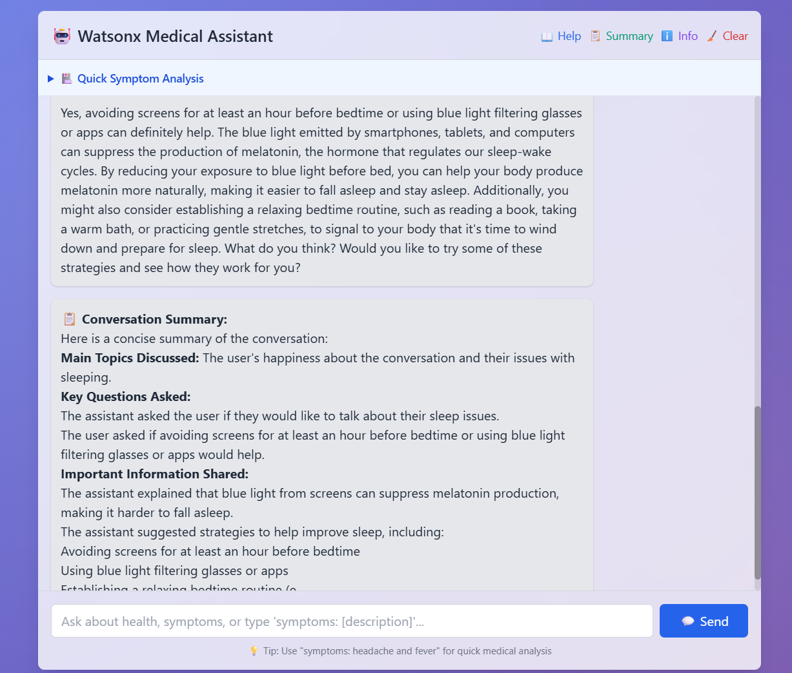

# Watsonx Medical Assistant

The Watsonx Medical Assistant is a sophisticated, web-based chat application designed to provide intelligent medical assistance. It leverages a persistent backend client to offer seamless conversational AI, in-depth symptom analysis, and dynamic conversation summaries, ensuring a responsive and robust user experience.

## Architecture Overview

The application is built on a modern, asynchronous architecture to ensure high performance and reliability.

-   **Persistent Backend Client:** Unlike traditional web applications that might spawn a new process for each request, this assistant uses a single, persistent `MCPWebClient` instance (`backend.py`). This client establishes a connection to a backend server process (`server.py`) on its first use and maintains this connection for all subsequent interactions.
-   **Asynchronous Operations:** All communication with the backend server is handled asynchronously in a dedicated background thread. This non-blocking approach ensures that the user-facing Flask web application remains fast and responsive, even while handling complex requests.
-   **Thread-Safe Design:** Synchronous components (like Flask routes) safely delegate tasks to the asynchronous event loop using `asyncio.run_coroutine_threadsafe()`, preventing common concurrency issues and ensuring stable, cross-thread communication.
-   **Graceful Shutdown:** The application includes an `atexit` hook to ensure that the backend connection is closed cleanly and the event loop is stopped gracefully when the application exits.

## Features

The assistant comes with a range of powerful features to help users with their medical inquiries.

### Medical Chat Assistant
Engage in natural, free-flowing conversations. The assistant can answer general questions, provide information, and maintain context throughout the discussion.


### Medical Symptom Analysis
Describe your symptoms, and the assistant will provide a preliminary analysis. The system uses a combination of explicit commands (e.g., `analyze: ...`) and keyword detection (e.g., "I have a fever and a headache") to automatically trigger the analysis tool.


### Conversation Summary Generation
At any point during the interaction, you can request a concise summary of the conversation so far. This is useful for reviewing key information discussed.



### Information Retrieval
The system is built on an extensible resource-based architecture, allowing it to retrieve specific information on demand, such as backend server details or predefined greetings.


Or if you prefer the cli version

## CLI Chatbot version


## Diagnosis


## Getting Started

To run the Watsonx Medical Assistant locally, follow these steps.

### Prerequisites
-   Python 3.11+
-   `make`

### Installation & Execution

1.  **Clone the repository:**
    ```bash
    git clone https://github.com/ruslanmv/watsonx-medical-mcp-server
    cd watsonx-medical-mcp-server
    ```

2.  **Set up the environment and install dependencies:**
    This project uses a `Makefile` to simplify setup. It will create a Python virtual environment in `.venv` and install all necessary packages.
    ```bash
    make setup
    ```

3.  **Start the MCP Server:**
    In one terminal, start the backend MCP server. This process will run continuously to handle requests.
    ```bash
    make run
    ```

4.  **Run the Chatbot Application:**
    In a second terminal, run the client application which provides the user interface.
    ```bash
    python chatbot.py
    ```

5.  **Chatbot CLI Application:**
    Or if you want something in the terminal  run the client application vi Terminal
    ```bash
    python chatbot-cli.py
    ```    

## Technology Stack

-   **Backend:** Python
-   **Web Framework:** Flask
-   **Concurrency:** `asyncio`, `threading`
-   **Build/Task Runner:** GNU Make
-   **Frontend:** HTML, CSS, JavaScript (implicitly)